>在上一篇《编译AOSP源码》将代码全部下载下来了，并且编译成功，那么如何去更方便的修改代码和开发就需要很多有利的工具。**工欲善其事必先利其器**

- SSH 服务
- VIM
- find 和 grep命令
- Samba
- AIDEGen
- VSCode
- adb

### SSH 服务

> SSH 服务可以是在其他平台上通过SSH客户端程序访问到Linux环境，方便开发。

在Linux端配置安装SSH服务：

```
sudo apt install openssh-server
```

SSH 配置

开启自动启动ssh服务端：

```
sudo systemctl enable ssh
sudo systemctl restart ssh # 重启下SSH服务
```

配置Linux端 固定的IP地址：

1. 安装net-tools工具

```
sudo apt install net-tools -y
```

2. 进入到`etc/netplan`目录下

```
cd /etc/netplan
sudo cp 01-network-manager-all.yaml 01-network-manager-all.yaml.bak
sudo vim 01-network-manager-all.yaml
```

设置静态IP之前，查看网络环境，我的网络环境如下

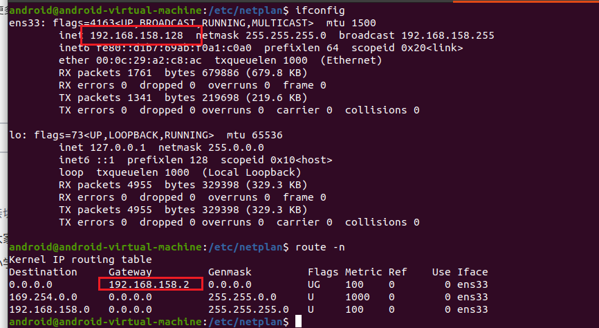

修改配置文件：

```
# Let NetworkManager manage all devices on this system
network:
  version: 2
  renderer: NetworkManager
  ethernets:
          ens33:
                addresses: [192.168.158.10/24]
                dhcp4: false
                optional: true
                gateway4: 192.168.158.2
                nameservers:
                    addresses: [8.8.8.8,114.114.114.114,192.168.158.2]

```

配置生效命令：

```
sudo netplan apply
```

IP 修改成功并顺利联网：

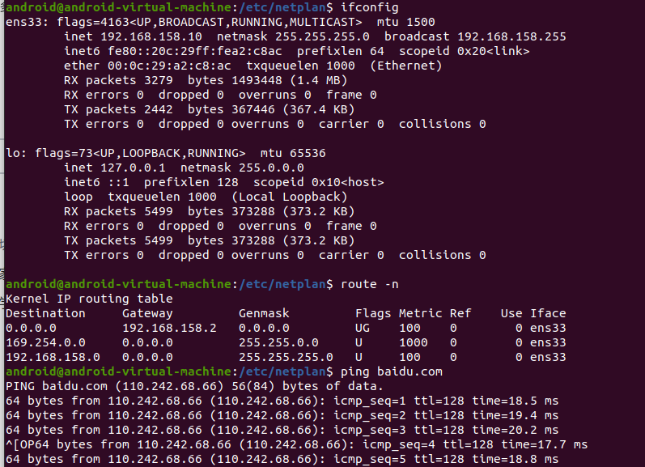

在windows 端安装SSH客户端就可以访问了：

我这里使用的是Tabby,也可以选择自己心意的SSH客户端 [Tabby - a terminal for a more modern age](https://tabby.sh/)
设置好主机和用户名、密码 连接即可：

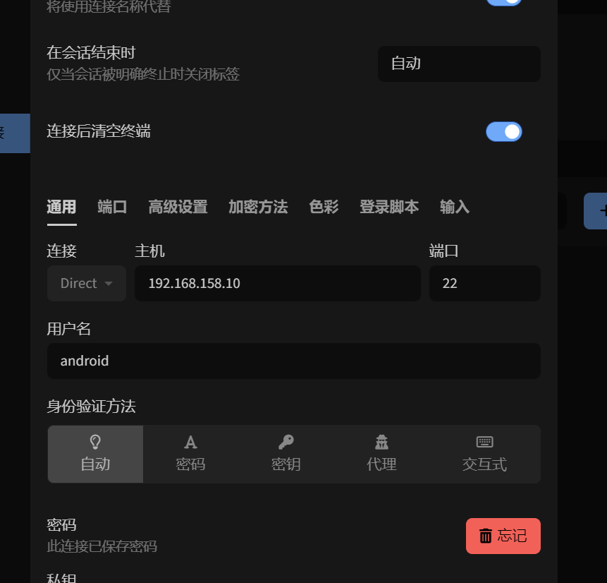

### VIM 命令

> vim 命令使用非常简单，熟悉几种常见的命令即可

`vim 文件名` 进入到一般模式

```
:q # 退出vim
:q! # 退出vim不保存文件
:wq # 保存并退出文件
```

编辑模式：

```
i 在光标所在处插入
a 在光标后面插入
o 在下一行插入
ESC 退出编辑模式
```

搜索模式：

```
:/ss # 搜索文本中匹配的ss字符，按 n 键查找下一个
```


### find + grep 命令

> 通过find + grep 命令查找源码文件，find 命令用来查找文件，grep 命令用来筛选文件内容

- 查找service_manager.c 文件

```
find . -name "service_manager.c"
```

可以很快的找到文件的目录路径：

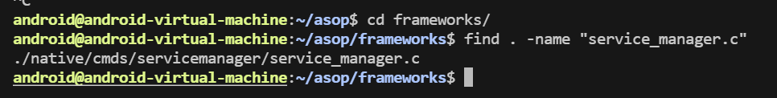

- 查找recyclerview库

recyclerview库在Android.bp中定义为：

```
android_library {
	name: ".*recyclerview.*",
}
```

找到所有的Android.dp,然后同grep命令 筛选文件内容：

```
find . -name "Android.bp" | xargs grep "name: \".*recyclerview.*\""
```

查找的结果如下：

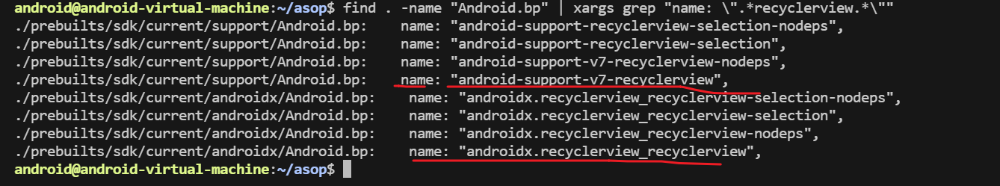

### Samba 服务器搭建

> Samba 是一个数据共享文件的软件，用来在windows和Linux共享文件。

安装smaba :

```
 sudo apt install samba
```


配置smaba:

```
sudo vim /etc/samba/smb.conf
```

配置如下

```
[Project]
        comment = project
        path =/home  # 共享的文件路径
        browseable = yes
        writable = yes
```

配置用户名和密码：

> -a 后面配置的是ubuntu系统的用户名

```
sudo smbpasswd -a android
```


配置samba 服务开机自启动

```
sudo systemctl enable smbd
sudo systemctl restart smbd
```


在Windows系统中：输入反斜杠和Ubuntu的IP地址即可

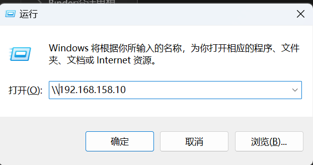

然后就可以看到共享文件了，然后将映射到网络驱动器，就可以在我的电脑中一直显示了：


如下图，会在网络位置展示共享文件的磁盘驱动：


### idegen + AndroidStudio

> idegen 查看Android的源码

进入到aosp源码目录执行： 
完成操作后，就会在源码下生成 android.ipr 和 android.iml 文件
打开 Android Studio，File->open，选择 android.ipr 文件。

```
source build/envsetup.sh
lunch aosp_x86_64-eng
make idegen -j16
mmm development/tools/idegen
development/tools/idegen/idegen.sh
```

### AIDEGen + AndroidStudio

> AIDEGen 在Android 10 推出的一个工具，用来方便系统开发

1. 首先需要编译SDK

```
source build/envsetup.sh
lunch sdk-eng
make sdk
```

需要编译好久，依据你的CPU和内存，我的虚拟机编译了5个小时

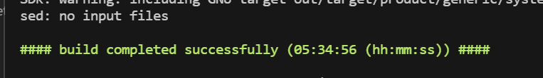

下载好AndroidStudio 放到根目录`/opt/` 下：

```
sudo chmod 777 /opt
cp '/home/android/Downloads/android-studio-2022.3.1.21-linux.tar.gz'  /opt
# 解压文件到 /opt 下
```

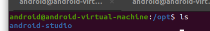

执行命令：`aidegen 模块名/模块路径 -i  s(s代表AndroidStudio)`

```
source build/envsetup.sh
lunch 26
aidegen Settings -i s  # -i 表示使用ide，s 表示 Android Studio
```

打开AndroidStudio后，配置JDK和SDK，点击 file -> Project Structure，AddJDK 添加JDK的路径在源码目录中如下图所示：选择`linux-x86` ,点击ok

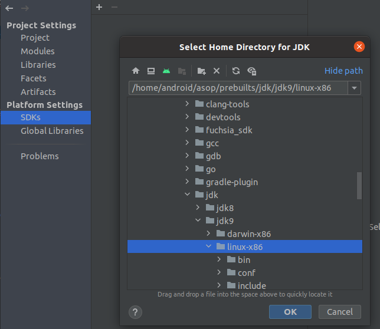

然后在点击+ Add Android SDK: 在源码的out目录下找到SDK，点击ok，可以重新命名SDK方便区分，我这里命名为：aosp10-android-sdk-29

`/home/android/asop/out/host/linux-x86/sdk/sdk/android-sdk_eng.android_linux-x86`

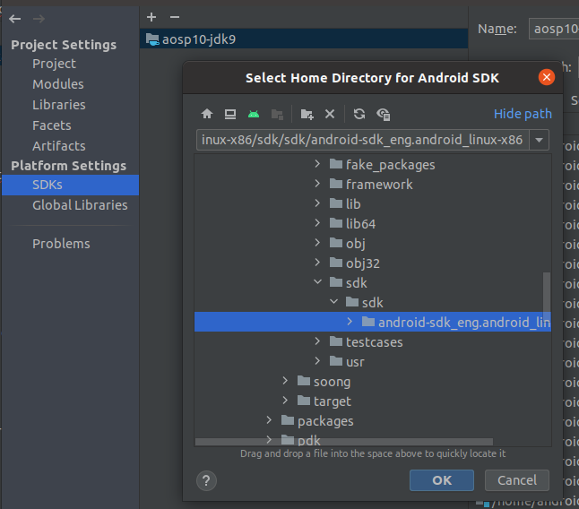

然后配置项目的SDK，选择添加的即可

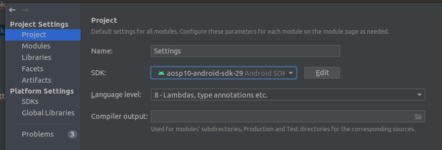

然后点击左侧的Modules，选择SDK，`Settings`和`dependencies-Settings`都要设置成，我们添加的SDK
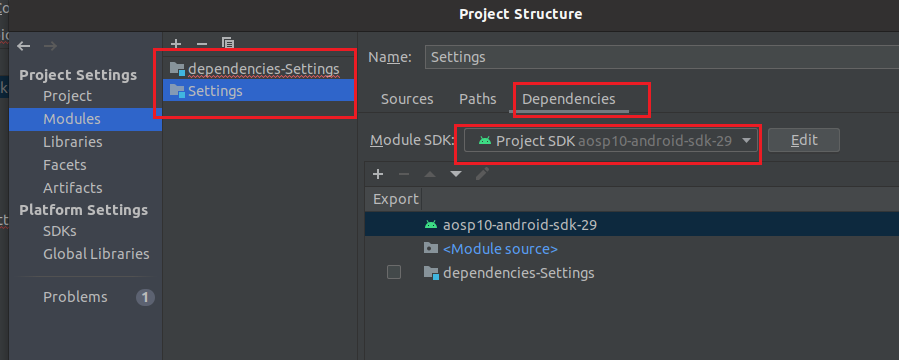

### 调试系统App Settings

在`AndroidManifest.xml`中找到，第一个启动的Activity：`SettingsHomepageActivity`

```xml
<activity android:name=".homepage.SettingsHomepageActivity"
          android:label="@string/settings_label_launcher"
          android:theme="@style/Theme.Settings.Home"
          android:launchMode="singleTask">
    <intent-filter android:priority="1">
        <action android:name="android.settings.SETTINGS" />
        <category android:name="android.intent.category.DEFAULT" />
    </intent-filter>
    <meta-data android:name="com.android.settings.PRIMARY_PROFILE_CONTROLLED"
               android:value="true" />
</activity>
```

添加断点，点击debug按钮

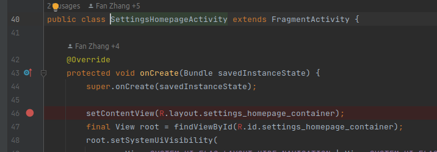

执行如下命令，打开模拟器：

```
source build/envsetup.sh
lunch aosp_x86_64-eng
emulator
```

然后在模拟器中，点击Setting App 

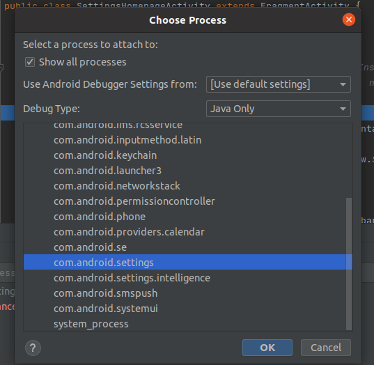

打开模拟器的Setting，就可以进行断点调试了：

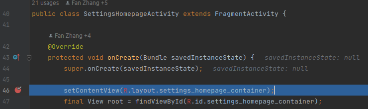

### VSCode

> VSCode 非常轻量级，提供了大量的插件，非常适合做系统开发，可以两种方式使用VSCode:
>
> - Ubuntu 本机使用
> - Windows 通过 remote-ssh 插件远程使用 VSCode 编辑linux 上的代码

#### Ubuntu 安装VSCode 

首先需要安装VSCode,可以从[官网]([Visual Studio Code - Code Editing. Redefined](https://code.visualstudio.com/))下载，或者从**Ubuntu Software** 中下载，安装完成后，需要安装一些插件：

- C/C++ Extension Pack
- Extension Pack for Java
- Makefile Tools
- RC Script language
- Android System Tools
- Android Studio Color Theme

可以打开整个系统源码或者某个系统模块进行开发了

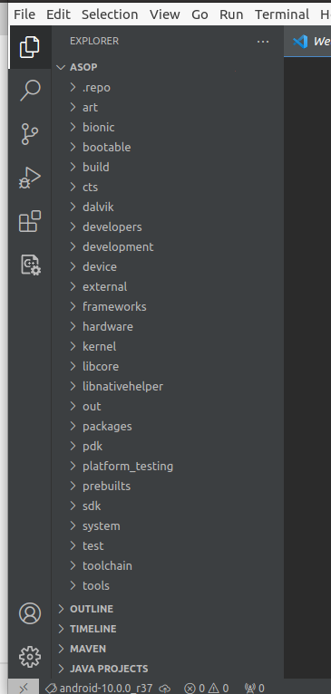


#### Windows 远程使用

> Windows 通过安装VScode的remote-ssh插件远程修改系统源码

安装完插件后，点击ssh图标,点击+号按钮，在弹出的输入框中，输入 `用户名@IP地址`，点击回车。接着，选择第一个配置文件，点击回车。打开的过程中，需要我们输入 Ubuntu 的登录密码。弹出新的 VSCode 窗口，我们点击 File -> Open Folder，然后选择我们的源码路径即可：

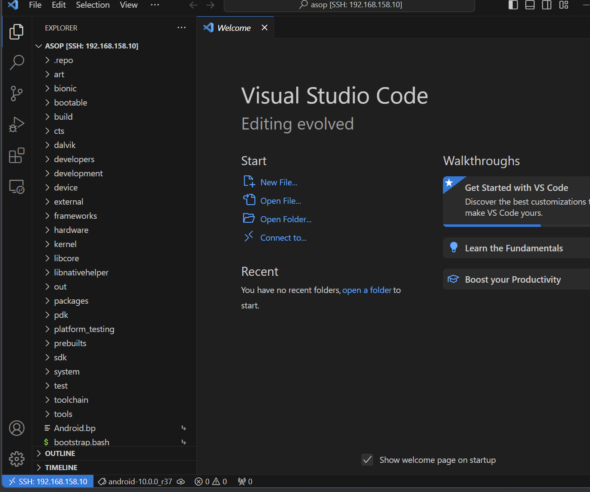

我们也可以通过配置，实现免密登录的效果：

打开 win 上的 PowerShell：

```
# 生成公钥
ssh-keygen -t rsa
cat ~/.ssh/id_rsa.pub
```

将公钥文件的内容拷贝到 ubuntu 的 ~/.ssh/authorized_keys 中，通过vim命令

Ubuntu 重启ssh服务

```
sudo systemctl restart ssh
```

关闭Vscode，重新打开 remote-ssh,点击在新窗口打开就可以直接连接了，不需要再次输入密码

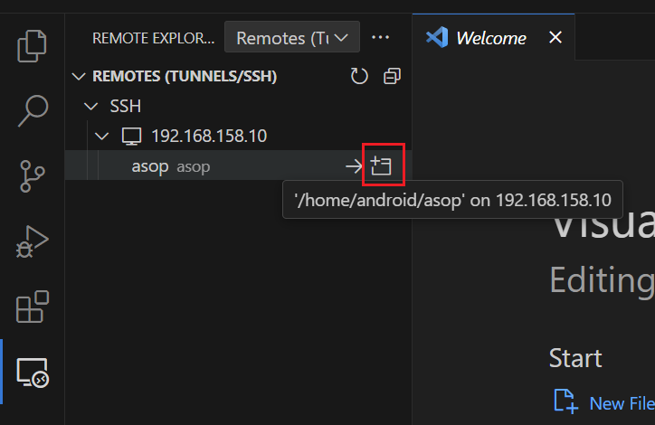


### adb

> 需要记住常用的adb命令，常见的adb push和 adb poll等命令

- adb push：将开发机上的文件上传到 Android 机器上

```
touch testfile
# 一些临时文件
adb push ./testfile /data/local/tmp
```

其他的常用命令：

```
// 查看当前正在运行的程序包名 
adb shell dumpsys window w |findstr \/ |findstr name=

adb devices #查看连接设备

adb -s cf27456f shell # 指定连接设备使用命令

adb install test.apk # 安装应用

adb install -r demo.apk #安装apk 到sd 卡：

adb uninstall cn.com.test.mobile #卸载应用，需要指定包

adb uninstall -k cn.com.test.mobile #卸载app 但保留数据和缓存文件

adb logcat #查看日志

adb logcat -c #清除log 缓存

adb reboot #重启

adb get-serialno #获取序列号

adb push <local> <remote> #从本地复制文件到设备

adb pull <remote> <local> #从设备复制文件到本地

adb bugreport #查看bug 报告

adb help #查看ADB 帮助

```

- adb shell：用于进入 Android 的 shell 终端

```
adb shell pm list packages #列出手机装的所有app 的包名

adb shell pm list packages -3 #列出除了系统应用的第三方应用包名

adb shell pm list packages | find "test" win 列出手机装带有的test的包

adb shell pm list packages | grep ‘test’ linux 列出手机装带有的test的包

adb shell pm clear cn.com.test.mobile #清除应用数据与缓存

adb shell am start -ncn.com.test.mobile/.ui.SplashActivity #启动应用

adb shell dumpsys package #包信息Package Information

adb shell dumpsys meminfo #内存使用情况Memory Usage

adb shell am force-stop cn.com.test.mobile #强制停止应用

adb shell getprop ro.build.version.release #查看Android 系统版本

adb shell top -s 10 #查看占用内存前10 的app

adb shell wm size 查看屏幕分辨率

adb shell wm density 查看屏幕密度
```

