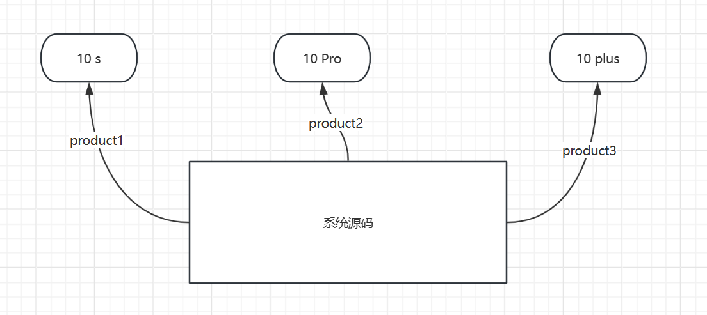
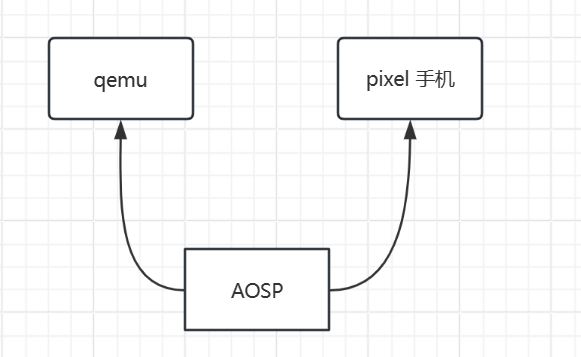
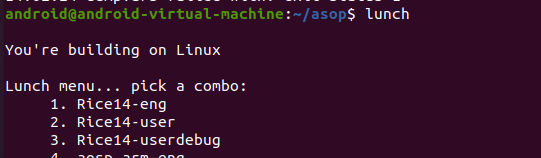
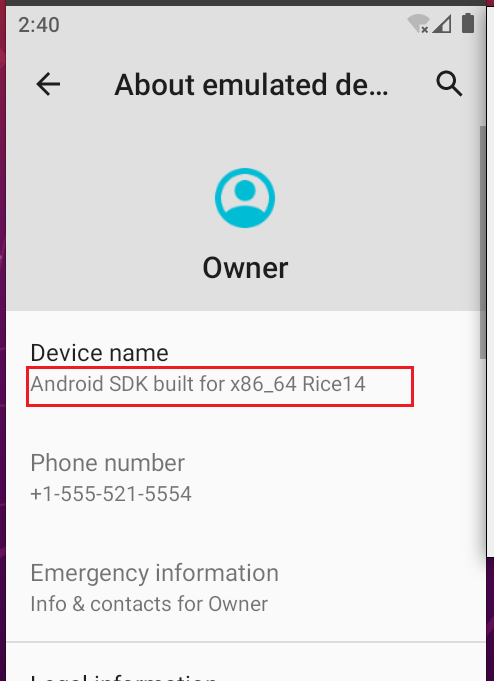

# 添加Product

> 在App开发时我们经常会添加渠道，根据不同的应用市场打不同的渠道包。例如xiaomi、huawei、oppo等渠道包

如下代码，在gradle中配置：

```groovy
productFlavors {
    huawei {
    }
    xiaomi {
    }
    yingyongbao {
    }
    productFlavors.all { flavor ->
        flavor.manifestPlaceholders = [UMENG_CHANNEL_VALUE: name]
    }
}
```

### 什么是Product

> 那么在Android系统开发时，也可以经过一些简单的配置打包出不同的系统镜像，用于不同的产品例如：小米10、小米10s、小米10Pro等均源于晓龙8+平台。
>
> Product 是一系列的配置文件，Product 的作用类似于app开发的gradle配置，用于将系统源码编译成不同的镜像文件，镜像文件用于不同的硬件产品

在AOSP源码中其实有预制的`Product`，没错就是`lunch` 命令展示的就是预制的`product`，下面的每一个选项就是一个`product`，AOSP预制了很多Product，对应于`x86_64`模拟器，之前我们编译的就是`aosp_x86_64-eng`

```
You're building on Linux

Lunch menu... pick a combo:     
     1. aosp_arm-eng
     2. aosp_arm64-eng
     3. aosp_blueline-userdebug
     4. aosp_bonito-userdebug
     5. aosp_car_arm-userdebug
     6. aosp_car_arm64-userdebug
     7. aosp_car_x86-userdebug
     8. aosp_car_x86_64-userdebug
     9. aosp_cf_arm64_phone-userdebug
     10. aosp_cf_x86_64_phone-userdebug
     11. aosp_cf_x86_auto-userdebug
     12. aosp_cf_x86_phone-userdebug
     13. aosp_cf_x86_tv-userdebug
     14. aosp_coral-userdebug
     15. aosp_coral_car-userdebug
     16. aosp_crosshatch-userdebug
     17. aosp_crosshatch_car-userdebug
     18. aosp_flame-userdebug
     19. aosp_marlin-userdebug
     20. aosp_sailfish-userdebug
     21. aosp_sargo-userdebug
     22. aosp_taimen-userdebug
     23. aosp_walleye-userdebug
     24. aosp_walleye_test-userdebug
     25. aosp_x86-eng
     26. aosp_x86_64-eng
     27. beagle_x15-userdebug
     28. car_x86_64-userdebug
     29. fuchsia_arm64-eng
     30. fuchsia_x86_64-eng
     31. hikey-userdebug
     32. hikey64_only-userdebug
     33. hikey960-userdebug
     34. hikey960_tv-userdebug
     35. hikey_tv-userdebug
     36. m_e_arm-userdebug
     37. mini_emulator_arm64-userdebug
     38. mini_emulator_x86-userdebug
     39. mini_emulator_x86_64-userdebug
     40. poplar-eng
     41. poplar-user
     42. poplar-userdebug
     43. qemu_trusty_arm64-userdebug
     44. uml-userdebug
```

Product 可以根据一套系统源码，而不是每一个手机品牌对应着一个系统源码，打包出不同的系统镜像，来用于不同的硬件产品



默认下载的AOSP可以打包出`qemu`用于模拟器的镜像，以及用于`pixel`手机的镜像



### Product 在哪里呢？

- `build/target` : 模拟器相关的`product`文件
- `device`: 实际硬件设备相关的`product`文件
- 针对我们编译的`aosp_x86_64-eng`主要关注以下几个文件
  - `build/target/board/generic_x86_64/BoardConfig.mk` 用于硬件相关配置
  - `build/target/product/AndroidProducts.mk`、`build/target/product/aosp_x86_64.mk`：用于配置Product

安装`tree`工具，查看目录：

```
sudo apt install tree
```

目录`build/target`结构如下所示：

可以看到有两个主要的目录分别是`board`和`product`，`board`目录下主要是一些硬件相关的配置，`product`目录主要是产品相关的配置

```
tree . -L 2
.
├── board
│   ├── Android.mk
│   ├── BoardConfigEmuCommon.mk
│   ├── BoardConfigGsiCommon.mk
│   ├── BoardConfigMainlineCommon.mk
│   ├── generic
│   ├── generic_arm64
│   ├── generic_arm64_ab
│   ├── generic_arm_ab
│   ├── generic_x86
│   ├── generic_x86_64
│   ├── generic_x86_64_ab
│   ├── generic_x86_ab
│   ├── generic_x86_arm
│   ├── go_defaults_512.prop
│   ├── go_defaults_common.prop
│   ├── go_defaults.prop
│   ├── gsi_arm64
│   ├── gsi_system.prop
│   ├── gsi_system_user.prop
│   └── mainline_arm64
├── OWNERS
└── product
    ├── AndroidProducts.mk
    ├── aosp_arm64_ab.mk
    ├── aosp_arm64.mk
    ├── aosp_arm_ab.mk
    ├── aosp_arm.mk
    ├── aosp_base.mk
    ├── aosp_base_telephony.mk
    ├── aosp_x86_64_ab.mk
    ├── aosp_x86_64.mk
    ├── aosp_x86_ab.mk
    ├── aosp_x86_arm.mk
    ├── aosp_x86.mk
    ├── base.mk
    ├── base_product.mk
    ├── base_system.mk
    ├── base_vendor.mk
    ├── cfi-common.mk
    ├── core_64_bit.mk
    ├── core_64_bit_only.mk
    ├── core_minimal.mk
    ├── developer_gsi_keys.mk
    ├── empty-preloaded-classes
    ├── empty-profile
    ├── emulator.mk
    ├── emulator_system.mk
    ├── emulator_vendor.mk
    ├── full_base.mk
    ├── full_base_telephony.mk
    ├── full.mk
    ├── full_x86.mk
    ├── generic.mk
    ├── generic_no_telephony.mk
    ├── generic_x86.mk
    ├── go_defaults_512.mk
    ├── go_defaults_common.mk
    ├── go_defaults.mk
    ├── gsi
    ├── gsi_arm64.mk
    ├── gsi_common.mk
    ├── gsi_keys.mk
    ├── handheld_product.mk
    ├── handheld_system.mk
    ├── handheld_vendor.mk
    ├── languages_default.mk
    ├── languages_full.mk
    ├── legacy_gsi_common.mk
    ├── mainline_arm64.mk
    ├── mainline.mk
    ├── mainline_system_arm64.mk
    ├── mainline_system.mk
    ├── media_product.mk
    ├── media_system.mk
    ├── media_vendor.mk
    ├── OWNERS
    ├── product_launched_with_k.mk
    ├── product_launched_with_l.mk
    ├── product_launched_with_l_mr1.mk
    ├── product_launched_with_m.mk
    ├── product_launched_with_n.mk
    ├── product_launched_with_n_mr1.mk
    ├── product_launched_with_o.mk
    ├── product_launched_with_o_mr1.mk
    ├── product_launched_with_p.mk
    ├── profile_boot_common.mk
    ├── runtime_libart.mk
    ├── sdk_arm64.mk
    ├── sdk.mk
    ├── sdk_phone_arm64.mk
    ├── sdk_phone_armv7.mk
    ├── sdk_phone_x86_64.mk
    ├── sdk_phone_x86.mk
    ├── sdk_x86_64.mk
    ├── sdk_x86.mk
    ├── security
    ├── telephony.mk
    ├── telephony_product.mk
    ├── telephony_system.mk
    ├── telephony_vendor.mk
    ├── updatable_apex.mk
    ├── vboot.mk
    └── verity.mk
```

下面来看具体的配置文件`BoardConfig.mk` 用于定义和硬件相关的底层特性和变量，比如当前源码执行的CPU位数(32/64),bootloader和kernel，是否支持摄像头，GPS导航等一些板级特性。

其中还通过`include`包含了`BoardConfigGsiCommon.mk`和`BoardConfigEmuCommon.mk`两个配置文件，前者用于通用系统映像的配置，后者用于模拟器的配置，主要和硬件相关，有一个基本了解即可。一般很少改动。

```makefile
TARGET_CPU_ABI := x86_64
TARGET_ARCH := x86_64
TARGET_ARCH_VARIANT := x86_64

TARGET_2ND_CPU_ABI := x86
TARGET_2ND_ARCH := x86
TARGET_2ND_ARCH_VARIANT := x86_64

TARGET_PRELINK_MODULE := false
include build/make/target/board/BoardConfigGsiCommon.mk
include build/make/target/board/BoardConfigEmuCommon.mk

BOARD_USERDATAIMAGE_PARTITION_SIZE := 576716800

BOARD_SEPOLICY_DIRS += device/generic/goldfish/sepolicy/x86

# Wifi.
BOARD_WLAN_DEVICE           := emulator
BOARD_HOSTAPD_DRIVER        := NL80211
BOARD_WPA_SUPPLICANT_DRIVER := NL80211
BOARD_HOSTAPD_PRIVATE_LIB   := lib_driver_cmd_simulated
BOARD_WPA_SUPPLICANT_PRIVATE_LIB := lib_driver_cmd_simulated
WPA_SUPPLICANT_VERSION      := VER_0_8_X
WIFI_DRIVER_FW_PATH_PARAM   := "/dev/null"
WIFI_DRIVER_FW_PATH_STA     := "/dev/null"
WIFI_DRIVER_FW_PATH_AP      := "/dev/null"
```

`AndroidProducts.mk` 用于定义执行的`lunch`命令时，打印的列表以及每个选项对应的配置文件：

```makefile
# TARGET_BUILD_APPS 编译Android系统时 这个值为null，编译单个模块时，这个值为所编译模块的路径

# 编译单个模块
ifneq ($(TARGET_BUILD_APPS),)
PRODUCT_MAKEFILES := \
    $(LOCAL_DIR)/aosp_arm64.mk \
    $(LOCAL_DIR)/aosp_arm.mk \
    $(LOCAL_DIR)/aosp_x86_64.mk \
    $(LOCAL_DIR)/aosp_x86.mk \
    $(LOCAL_DIR)/full.mk \
    $(LOCAL_DIR)/full_x86.mk \
# 编译系统
else
PRODUCT_MAKEFILES := \
    $(LOCAL_DIR)/aosp_arm64_ab.mk \
    $(LOCAL_DIR)/aosp_arm64.mk \
    $(LOCAL_DIR)/aosp_arm_ab.mk \
    $(LOCAL_DIR)/aosp_arm.mk \
    $(LOCAL_DIR)/aosp_x86_64_ab.mk \
    $(LOCAL_DIR)/aosp_x86_64.mk \
    $(LOCAL_DIR)/aosp_x86_ab.mk \
    $(LOCAL_DIR)/aosp_x86_arm.mk \
    $(LOCAL_DIR)/aosp_x86.mk \
    $(LOCAL_DIR)/full.mk \
    $(LOCAL_DIR)/full_x86.mk \
    $(LOCAL_DIR)/generic.mk \
    $(LOCAL_DIR)/generic_x86.mk \
    $(LOCAL_DIR)/gsi_arm64.mk \
    $(LOCAL_DIR)/mainline_arm64.mk \
    $(LOCAL_DIR)/mainline_system_arm64.mk \
    $(LOCAL_DIR)/sdk_arm64.mk \
    $(LOCAL_DIR)/sdk.mk \
    $(LOCAL_DIR)/sdk_phone_arm64.mk \
    $(LOCAL_DIR)/sdk_phone_armv7.mk \
    $(LOCAL_DIR)/sdk_phone_x86_64.mk \
    $(LOCAL_DIR)/sdk_phone_x86.mk \
    $(LOCAL_DIR)/sdk_x86_64.mk \
    $(LOCAL_DIR)/sdk_x86.mk \

endif
# 配置我们在lunch时的选项
COMMON_LUNCH_CHOICES := \
    aosp_arm64-eng \
    aosp_arm-eng \
    aosp_x86_64-eng \
    aosp_x86-eng \
```

`PRODUCT_MAKEFILES` 用于引入产品的配置文件

`COMMON_LUNCH_CHOICES` 用于添加 lunch 时的选项，选项的名字由两部分过程 `产品名 + 构建模式`：

- 产品名就是 `PRODUCT_MAKEFILES` 中引入的产品配置文件名去掉 `.mk` 后缀，例如 `aosp_x86_64`
- 构建模式有三种：用户模式 `user`、用户调试模式 `userdebug` 和工程模式 `eng`

**用户模式 user:**

- 仅安装标签为user的模块
- 设定属性ro.secure=1,打开安全检查功能
- 设定属性ro.debuggable=0,关闭应用调试功能
- 默认关闭adb功能
- 打开Proguard混淆器
- 打开DEXPREOPT预先编译优化

**用户调试模式 userdebug：**

- 安装标签为user、debug的模块
- 设定属性ro.secure=1,打开安全检查功能
- 设定属性ro.debuggable=1,启用应用调试功能
- 默认打开adb功能
- 打开Proguard混淆器
- 打开DEXPREOPT预先编译优化

**工程模式eng:**

- 安装标签为user、debug、eng的模块
- 设定属性ro.secure=0,关闭安全检查功能
- 设定属性ro.debuggable=1,启用应用调试功能
- 默认打开adb功能
- 关闭Proguard混淆器
- 关闭DEXPREOPT预先编译优化

`aosp_x86_64.mk` : 这个文件就是产品配置的主要基地

```makefile
$(call inherit-product, $(SRC_TARGET_DIR)/product/core_64_bit.mk)
$(call inherit-product, $(SRC_TARGET_DIR)/product/gsi_common.mk)

# Emulator for vendor inherit-product 和include功能类似
$(call inherit-product-if-exists, device/generic/goldfish/x86_64-vendor.mk)
$(call inherit-product, $(SRC_TARGET_DIR)/product/emulator_vendor.mk)
$(call inherit-product, $(SRC_TARGET_DIR)/board/generic_x86_64/device.mk)

# Enable mainline checking for excat this product name
ifeq (aosp_x86_64,$(TARGET_PRODUCT))
PRODUCT_ENFORCE_ARTIFACT_PATH_REQUIREMENTS := relaxed
endif

PRODUCT_ARTIFACT_PATH_REQUIREMENT_WHITELIST += \
    root/init.zygote32_64.rc \
    root/init.zygote64_32.rc \

# Copy different zygote settings for vendor.img to select by setting property
# ro.zygote=zygote64_32 or ro.zygote=zygote32_64:
#   1. 64-bit primary, 32-bit secondary OR
#   2. 32-bit primary, 64-bit secondary
# init.zygote64_32.rc is in the core_64_bit.mk below
PRODUCT_COPY_FILES += \
    system/core/rootdir/init.zygote32_64.rc:root/init.zygote32_64.rc

PRODUCT_NAME := aosp_x86_64
PRODUCT_DEVICE := generic_x86_64
PRODUCT_BRAND := Android
PRODUCT_MODEL := AOSP on x86_64
```

**inherit-product** 函数表示继承另外一个文件

在 Makefile 中可使用 **“-include”** 来代替 “include”，来忽略由于包含文件不存在或者无法创建时的错误提示（“-”的意思是告诉make，忽略此操作的错误。make继续执行）,如果不加-,当 include 的文件出错或者不存在的时候， make 会报错并退出。

`include` 和 `inherit-product` 的区别：

- 假设 `PRODUCT_VAR := a` 在 A.mk中，`PRODUCT_VAR := b` 在B.mk中
- 如果你在A.mk中`include B.mk`,你最终会得到PRODUCT_VAR := b
- 但是如果你在`A.mk inherit-product B.mk`，你会得到 PRODUCT_VAR := a b.并inherit-product 确保您不会两次包含同一个makefile

Product 文件中涉及到的几个变量：

- 通用变量
- 路径变量
- 自定义变量
- 功能变量

**通用变量**

```
PRODUCT_NAME := aosp_x86_64
PRODUCT_DEVICE := generic_x86_64
PRODUCT_BRAND := Android
PRODUCT_MODEL := AOSP on x86_64
```

**路径变量**

```
LOCAL_DIR 值为：当前目录
SRC_TARGET_DIR 值为：build/target	
```

**自定义变量**：该变量如何使用，取决于开发者自己

```
BOARD_DDR_VAR_ENABLED := true
```

**功能变量**：该变量有特殊的功能

- PRODUCT_COPY_FILES：用于完成拷贝，可以将源码中的文件拷贝到编译好的分区文件中

```
PRODUCT_COPY_FILES += vendor/rockchip/common/phone/etc/spn-conf.xml:system/etc/spn-conf.xml
```

- PRODUCT_PROPERTY_OVERRIDES： 用于设置系统属性(覆盖)

```
PRODUCT_PROPERTY_OVERRIDES += \
    ro.product.version = 1.0.0 \
```


### 添加自己的Product

> 场景：假设公司Prim,正在开发一款手机，取名字叫rice14

1. 在`device`目录源码中添加自己的产品

创建prim目录，创建rice14目录，然后创建如下的几个文件:

```
├── Prim
│   └── Rice14
│       ├── AndroidProducts.mk
│       ├── BoardConfig.mk
│       └── Rice14.mk
```

`BoardConfig.mk` 包含了硬件芯片架构配置，区分大小配置等信息这里直接使用**asop_x86_64**的`BoardConfig.mk`即可。`BoardConfig.mk` 拷贝自 `build/target/board/generic_x86_64/BoardConfig.mk`

```makefile
TARGET_CPU_ABI := x86_64
TARGET_ARCH := x86_64
TARGET_ARCH_VARIANT := x86_64

TARGET_2ND_CPU_ABI := x86
TARGET_2ND_ARCH := x86
TARGET_2ND_ARCH_VARIANT := x86_64

TARGET_PRELINK_MODULE := false
include build/make/target/board/BoardConfigGsiCommon.mk
include build/make/target/board/BoardConfigEmuCommon.mk

BOARD_USERDATAIMAGE_PARTITION_SIZE := 576716800

BOARD_SEPOLICY_DIRS += device/generic/goldfish/sepolicy/x86

# Wifi.
BOARD_WLAN_DEVICE           := emulator
BOARD_HOSTAPD_DRIVER        := NL80211
BOARD_WPA_SUPPLICANT_DRIVER := NL80211
BOARD_HOSTAPD_PRIVATE_LIB   := lib_driver_cmd_simulated
BOARD_WPA_SUPPLICANT_PRIVATE_LIB := lib_driver_cmd_simulated
WPA_SUPPLICANT_VERSION      := VER_0_8_X
WIFI_DRIVER_FW_PATH_PARAM   := "/dev/null"
WIFI_DRIVER_FW_PATH_STA     := "/dev/null"
WIFI_DRIVER_FW_PATH_AP      := "/dev/null"
```

Rice14.mk 拷贝自 `build/target/product/aosp_x86_64.mk`

其中的 if 语句需要注释掉，同时需要修改最后四行

```makefile
# GSI for system/product
$(call inherit-product, $(SRC_TARGET_DIR)/product/core_64_bit.mk)
$(call inherit-product, $(SRC_TARGET_DIR)/product/gsi_common.mk)

# Emulator for vendor inherit-product 和include功能类似
$(call inherit-product-if-exists, device/generic/goldfish/x86_64-vendor.mk)
$(call inherit-product, $(SRC_TARGET_DIR)/product/emulator_vendor.mk)
$(call inherit-product, $(SRC_TARGET_DIR)/board/generic_x86_64/device.mk)

# Enable mainline checking for excat this product name
#ifeq (aosp_x86_64,$(TARGET_PRODUCT))
PRODUCT_ENFORCE_ARTIFACT_PATH_REQUIREMENTS := relaxed
#endif

PRODUCT_ARTIFACT_PATH_REQUIREMENT_WHITELIST += \
    root/init.zygote32_64.rc \
    root/init.zygote64_32.rc \

# Copy different zygote settings for vendor.img to select by setting property
# ro.zygote=zygote64_32 or ro.zygote=zygote32_64:
#   1. 64-bit primary, 32-bit secondary OR
#   2. 32-bit primary, 64-bit secondary
# init.zygote64_32.rc is in the core_64_bit.mk below
PRODUCT_COPY_FILES += \
    system/core/rootdir/init.zygote32_64.rc:root/init.zygote32_64.rc

PRODUCT_NAME := Rice14
PRODUCT_DEVICE := Rice14
PRODUCT_BRAND := Prim
PRODUCT_MODEL := Android SDK built for x86_64 Rice14
```

`AndroidProducts.mk` 内容如下：

```makefile
PRODUCT_MAKEFILES :=\
	$(LOCAL_DIR)/Rice14.mk

COMMON_LUNCH_CHOICES :=\
	Rice14-eng\
	Rice14-userdebug\
	Rice14-user
```

做完上述操作后进行编译验证：

```
source build/envsetup.sh
lunch
```



1-3就是我们自己添加的产品，我们来编译1，然后启动模拟器：

```
m
emulator
```

启动模拟器后，在关于页面就可以看到产品信息


