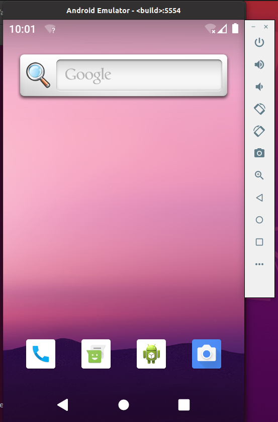
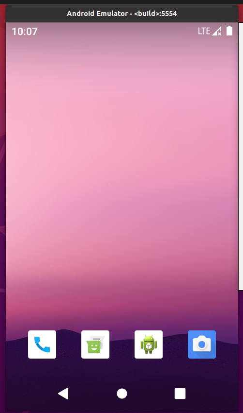

## AOSP 介绍

> Android 开放系统平台 (AOSP) 是公开发布且可修改的 Android 源代码。任何人都可以下载并修改其设备的 AOSP。AOSP 提供 Android 移动平台的完整且功能完备的实现。

AOSP 全称 Android 开源项目(Android Open Source Project),Android 是一个适用于移动设备的开源操作系统，也是由 Google 主导的对应开源项目。此网站和 Android 开源项目 (AOSP) 代码库可为您提供所需信息和源代码，供您创建定制的 Android OS 版本，将设备和配件移植到 Android 平台，同时确保设备符合兼容性要求，从而让 Android 生态系统维持良好稳健的运行环境，以便更好地服务于数百万用户。文档([Android 开源项目  | Android Open Source Project (google.cn)](https://source.android.google.cn/?hl=zh-cn))


## 硬件环境

AOSP 的下载、编译理论上支持 Mac和Linux，但是不建议在非 Linux 环境下尝试编译，坑太多了，建议使用Linux系统进行编译。

下载 Android 12 及以后的版本，需要至少100GB的硬盘空间，编译Android 12 则需要300GB的硬盘空间和16GB以上的内存，低于这个配置在编译时大概率会报错。

本篇文章使用Android 10的AOSP版本演示


建议硬件环境如下：

- Ubuntu 20.0.4版本的系统
- 内存：32G (建议64G)
- 硬盘：512G(建议1T)
- CPU：12核 16线程

如下是我的虚拟机的硬件环境：


## Repo源码管理工具

安装完Ubuntu系统后，在下载Android源码之前，要先安装其构建工具 Repo 来初始化源码。Repo是Android用来辅助Git工作的一个工具。(Repo命令的详解在下一篇文章中讲解)
### Repo

#### Repo 简介

Repo是Google使用python脚本编写的用于调用Git的脚本，主要用来下载、管理Android项目的软件仓库。
Repo不会取代Git，但是它可以让开发者在Android环境中更加轻松的使用Git。
在大多数情况下，确实可以仅使用 Git（不必使用 Repo），或结合使用 Repo 和 Git 命令以组成复杂的命令。不过，使用 Repo 执行基本的跨网络操作可大大简化我们的工作。

#### 安装 Repo

Android源码同时使用git和repo进行管理，repo是基于git的代码管理工具，类似github、gitee，所以需要同时安装git和repo

第 1 步，创建一个bin目录，并将这个目录添加到系统的环境变量中

```bash
mkdir ~/bin
PATH=~/bin:$PATH
```

第 2 步，下载 repo

```bash
curl https://mirrors.tuna.tsinghua.edu.cn/git/git-repo -o ~/bin/repo
chmod +x ~/bin/repo
```

安装完repo后需要使用`source`指令重新加载linux的配置环境。

### Git

#### Git 简介

Git是一个开源的分布式版本控制系统，可以有效、高速地处理从很小到非常大的项目版本管理。也是目前使用范围最广的版本控制系统。

Android 使用 Git 执行本地操作，例如建立本地分支、提交、对比差异、修改。Google 最初决定使用一种分布式修订版本控制系统，经过筛选最后选中了Git。

#### 安装 Git

第 1 步，执行安装指令

```
sudo apt install git
```

第 2 步，配置 Git 全局环境

```arduino
git config --global user.name "用户名"
git config --global user.email "邮箱"
```

第 3 步， 生成 ssh 秘钥（可选配置）

```
ssh-keygen
```

一直按回车，生成的秘钥文件会在 `~/.ssh`目录下载，我们将`~/.ssh`目录下的`id_rsa.pub` 里面的内容复制到仓库管理系统相应的SSH Key中，在后续的代码下载时就不需要再输入用户名和密码。

> 常见的源码仓库管理系统是Gerrit 和 GItLab。

### 在线阅读、检索AOSP源码

[aospxref.com/](https://link.juejin.cn?target=http%3A%2F%2Faospxref.com%2F) 是一个在线的 AOSP 源码阅读网站，在这个网站上我们可以很轻松，阅读、检索 Android 的源码，而且对于车载 Android 开发而言，阅读源码十分的重要。

## 下载 AOSP

下载 AOSP 有以下两种方式

- 使用初始化源码包

中科大和清华大学提供了AOSP源码的压缩包，现在的包大约有60GB左右，可以使用命令行或迅雷等下载工具下载。

优点：下载速度快，支持断点续传。

缺点：不贴近工作环境，实际项目中不使用这种方式。

清华大学文档：[mirrors.tuna.tsinghua.edu.cn/help/AOSP/](https://link.juejin.cn?target=https%3A%2F%2Fmirrors.tuna.tsinghua.edu.cn%2Fhelp%2FAOSP%2F)

中科大文档：[mirrors.ustc.edu.cn/help/aosp.h…](https://link.juejin.cn?target=https%3A%2F%2Fmirrors.ustc.edu.cn%2Fhelp%2Faosp.html)

- 使用 repo 直接同步源码

使用repo直接同步源码，是Android官方文档中使用的方式。

优点：更贴近工作环境。在实际项目中也是使用这种方式同步Android源码。

缺点：源码太大，外网不稳定、速度很慢，容易同步失败（实际项目中，我们使用公司内网不会存在这个问题）。

官方文档：[source.android.google.cn/docs/setup/…](https://link.juejin.cn?target=https%3A%2F%2Fsource.android.google.cn%2Fdocs%2Fsetup%2Fdownload%2Fdownloading%3Fhl%3Dzh-cn)

由于下载Android源码非常消耗服务器的带宽和I/O，中科大和清华大学的文档中都强烈要求我们使用第一种方式同步源代码。

如果下载Android官方的AOSP的源码，UP建议使用下载压缩包的方式，如果是下载公司项目的Android源码，则只能使用repo同步。

下面建议使用repo的方式直接同步源码：

**第 1 步，建立工作目录**

同样的，在开始下载AOSP源码之前，需要在合适的位置创建一个目录用于放置源码，使用如下命令：

```bash
mkdir AOSP
cd AOSP
```

**第 2 步，初始化仓库**

使用repo init 指令初始化源码仓库。

```bash
repo init -u https://mirrors.tuna.tsinghua.edu.cn/git/AOSP/platform/manifest
```

**第 3 步，同步源码**

执行repo sync 指令同步源码。

```bash
repo sync
```

repo 的运行过程中会尝试访问官方的 git 源更新自己，如果想使用 tuna 的镜像源进行更新，可以将如下内容复制到你的 ~/.bashrc。

```ini
export REPO_URL='https://mirrors.tuna.tsinghua.edu.cn/git/git-repo'
PATH=~/bin:$PATH
```

然后执行命令：

```shell
source ~/.bashrc
```

如果需要同步指定的Android版本，只需要在repo init之后加上-b带上分支名称即可。

```bash
#初始化仓库，-b 指示分支，这里使用Android 10
repo init -u https://mirrors.tuna.tsinghua.edu.cn/git/AOSP/platform/manifest -b android-10.0.0_r41
#同步远程代码
repo sync
```

有关repo的更多使用方式，可以详细阅读中科大或清华大学的官方文档，这里不再赘述。

------

### Android 源码文件目录结构

- package

应用层（Application）源码。系统应用就在这里了，比如说系统设置，桌面，相机，电话之类的。

- frameworks

系统框架（Framework）层源码。

- hardware

硬件抽象（HAL）层源码。

- out

输出目录。编译以后生成的目录，相关的产出就在这里了

- build

用于构建Android系统的工具。也就是用于编译Android系统的

## 编译 AOSP

### 配置编译环境

编译Android源码会用到很多第三方库，我们需要先将这些库配置好，指令如下：

> 需要注意如果你编译的是Android12 以下需要使用python2,如果编译Android 12及以上则需要使用pyton3

```bash
sudo apt update
sudo apt-get install git-core gnupg flex bison build-essential zip curl zlib1g-dev gcc-multilib g++-multilib libc6-dev-i386 libncurses5 lib32ncurses5-dev x11proto-core-dev libx11-dev lib32z1-dev libgl1-mesa-dev libxml2-utils xsltproc unzip fontconfig python3
sudo apt install python-is-python3
sudo apt clean && sudo apt autoremove -y
```

### 编译 Android 镜像

**第 1 步，加载环境变量**

在Android源码根目录执行`source build/envsetup.sh`，该指令会将`lunch`以及其他程序和变量添加到shell环境中。

```bash
cd aosp
source build/envsetup.sh
```

**第 2 步，选择编译的目标**

这里选择 `26.asop_x86_64-eng` 进行编译，编译的是手机的模式
```shell
lunch
26 # 选择手机系统
m # 自动选择适合的线程进行编译
emulator # 启动模拟器使用编译好的系统
```

如果要编译车载系统，这里我们选择 `car_x86_64-userdebug`。

> 执行lunch指令之前，当前窗口的shell环境必须已经执行过`source build/envsetup.sh`

**第 3 步，执行编译**

make 指令是aosp的编译指令，支持并发编译。可以使用-j指定并发编译的线程数。电脑的CPU核心数越多，可以设定的线程数就越大，编译速度也就越快，一般可以设为CPU线程数。如果不指定，构建系统会自动选择当前操作系统最适合的并行线程数。

```shell
make -j16 # 指定线程数
m #自动匹配线程数
```

在调用 make 命令时，如果没有指定任何目标，则将使用默认的名称为“droid”目标，该目标会编译出完整的 Android 系统镜像。

**第 5 步，启动模拟器**

编译的时长取决于电脑的性能，首次编译约需要耗时约2-5个小时，控制台提示 build completed successfully则表示编译成功了。然后执行emulator就可以启动模拟器了。

```
emulator
```

等待开机动画播放完毕，看到Launcher界面，就表示编译成功了。如果编译后出现模拟器黑屏无法启动，可以再执行lunch sdk_car_x86_64-userdebug，然后再make一次。


> 注意这里用的是模拟器，选择编号**26**进行编译

- user: 限制所有权限，发布版
- userdebug: 允许root
- eng: 开发版，开放所有权限

下次再启动虚拟机需要执行的命令如下：

```shell
source build/envsetup.sh
lunch 26
emulator
```

模拟器启动，则说明AOSP编译成功：



### AOSP 中的单编和整编

修改Android源码后如何进行编译？进入到指定的目录使用`mm`或者`mmm`指定修改的目录进行编译

```shell
mm # 编译当前模块
mmm # 编译指定模块 mmm packeage/apps/Luncher3
```

```shell
m：  编译所有的模块 整编
mm： 编译当前目录下的模块，当前目录下要有Android.mk文件
mmm：编译指定路径下的模块，指定路径下要有Android.mk文件

使用这些命令前需要在android源码根目录执行source build/envsetup.sh脚本设置环境
举例子，编译Camera2模块步骤：
1.源代码目录下执行source build/envsetup.sh脚本设置环境
2.直接执行mmm packages/apps/Camera2/
或者等价于
1.源代码目录下执行source build/envsetup.sh脚本设置环境
2.先切换目录cd packages/apps/Camera2/
3.执行mm
最后使用make snod重新生成sysem.img步骤：
1.source build/envsetup.sh
2.lunch 然后选择2   [[选择2是选择和编译整个系统时的选择一致。]]
3.make snod           [[先执行lunch，不然make]] snod报错build_image.py - ERROR。
```

##### 清理编译中间产物，以便重新开始编译
```c
1、在源码目录的根目录下，执行make clean;
2、进到源码的\linux\kernel\目录下，执行make mrproper；
3、再退回到根目录，执行source build/envsetup.sh, lunch, make -j16；
```

##### 生成工程信息文件 支持源码导入到AS中
依次执行以下命令，生成IDE工程信息文件 **android.ipr** 和 **android.iml**
```bash
source build/envsetup.sh
mmma development/tools/idegen
development/tools/idegen/idegen.sh
```
此时如果直接使用Android studio打开`android.ipr`，会特别慢，因为太多东西了，一直在索引。所以打开之前我们需要编辑一下`android.iml`配置文件。

我们可以使用下面的配置文件替代原始的配置文件，加快导入速度。该配置文件要求Android Studio只引入package模块的源码。如果有需要也可以引入frameworks模块的源码。

```xml
<?xml version="1.0" encoding="UTF-8"?>
<module version="4" relativePaths="true" type="JAVA_MODULE">
  <component name="FacetManager">
    <facet type="android" name="Android">
      <configuration />
    </facet>
  </component>
  <component name="ModuleRootManager" />
    <component name="NewModuleRootManager" inherit-compiler-output="true">
    <exclude-output />
    <content url="file://$MODULE_DIR$">
      <sourceFolder url="file://$MODULE_DIR$/packages" />
      <excludeFolder url="file://$MODULE_DIR$/frameworks" />
      <excludeFolder url="file://$MODULE_DIR$/.repo" />
      <excludeFolder url="file://$MODULE_DIR$/external/bluetooth" />
      <excludeFolder url="file://$MODULE_DIR$/external/chromium" />
      <excludeFolder url="file://$MODULE_DIR$/external/icu4c" />
      <excludeFolder url="file://$MODULE_DIR$/external/webkit" />
      <excludeFolder url="file://$MODULE_DIR$/frameworks/base/docs" />
      <excludeFolder url="file://$MODULE_DIR$/out/eclipse" />
      <excludeFolder url="file://$MODULE_DIR$/out/host" />
      <excludeFolder url="file://$MODULE_DIR$/out/target/common/docs" />
      <excludeFolder url="file://$MODULE_DIR$/out/target/common/obj/JAVA_LIBRARIES/android_stubs_current_intermediates" />
      <excludeFolder url="file://$MODULE_DIR$/out/target/product" />
      <excludeFolder url="file://$MODULE_DIR$/prebuilt" />
      <excludeFolder url="file://$MODULE_DIR$/external/emma" />
      <excludeFolder url="file://$MODULE_DIR$/external/jdiff" />
    </content>
    <orderEntry type="sourceFolder" forTests="false" />
    <orderEntry type="inheritedJdk" />
  </component>
</module>

```
#### android 系统映射文件说明
| **img名称** | **作用** |
| --- | --- |
| boot.img | 内核引导启动有关镜像 |
| ramdisk.img | 文件系统有关镜像，包含android系统文件根目录等 |
| system.img |android系统核心镜像，包含framework、系统app等，挂载在/system下|
| userdata.img |应用程序数据镜像，挂载在/data下|
| cache.img | 临时数据存放镜像 |

### 编译过程遇到的问题

#### FAILED: out/target/product/generic_x86_64/system-qemu.img

如果编译的是Android 10或以下版本使用的python2,需要注意编译环境的python版本
需要转到文件`/android/device/generic/goldfish/tools/mk_combined_img.py`并将第一行：`#!/usr/bin/python`更改为`#!/usr/bin/python2`
应该可以正常编译了.

**1.以 root 身份登录，首先罗列出所有可用的python 替代版本信息**

```text
update-alternatives --list python 
```

这一步可能会**报错**update-alternatives: error: no alternatives for python

**2.如果出现以上所示的错误信息，则表示 Python 的替代版本尚未被update-alternatives 命令识别。想解决这个问题，我们需要更新一下替代列表，将python2.7 和 python3.6 放入其中。**

```text
update-alternatives --install /usr/bin/python python /usr/bin/python2.7 1  
update-alternatives --install /usr/bin/python python /usr/bin/python3.6 2 
```

最后的1、2、3...代表序号，后面会有用  

**3.再次列出可用的 Python 替代版本**

```text
update-alternatives --list python 
```

**4.我们就可以使用下方的命令随时在列出的 Python 替代版本中任意切换了**

```text
update-alternatives --config python 
```


输入数字,选择版本.

#### 启动模拟器遇到的问题

```
emulator
```
KVM错误

emulator: ERROR: x86 emulation currently requires hardware acceleration!
Please ensure KVM is properly installed and usable.

CPU acceleration status: KVM is not installed on this machine (/dev/kvm is missing).

```
egrep -c '(vmx|svm)' /proc/cpuinfo
```
先使用该指令查看是否支持虚拟化，如果不支持的话在虚拟机的CPU选项中打开即可。

```
sudo apt-get install qemu-kvm libvirt-bin ubuntu-vm-builder bridge-utils
sudo adduser `id -un` libvirtd
sudo adduser `id -un` kvm
```

[[检查是否安装成功]]
sudo kvm-ok

模拟器黑屏

```
emulator -partition-size 4096 -kernel ./prebuilts/qemu-kernel/x86/4.9/kernel-qemu2
```
通过使用kernel-qemu-armv7内核 解决模拟器等待黑屏问题.而-partition-size 4096则是解决警告: system partion siez adjusted to match image file (3083 MB > 800 MB)

模拟器启动后崩溃
VMware: vmw_ioctl_command error Invalid argument.
Aborted (core dumped)

关闭硬件加速

```
export SVGA_VGPU10=0
echo "export SVGA_VGPU10=0" >> ~/.bashrc
source ~/.bashrc
```

### 体验Framework开发，去掉Launcher中的Google搜索栏

Google搜索栏在中国是没有办法使用的，那么在中国销售的产品必定是要去掉

1. 修改文件`packages/apps/Launcher3/res/layout/search_container_workspace.xml`将fragment注释掉

```xml
<com.android.launcher3.qsb.QsbContainerView
        xmlns:android="http://schemas.android.com/apk/res/android"
        android:orientation="vertical"
        android:layout_width="match_parent"
        android:layout_height="0dp"
        android:id="@id/search_container_workspace"
        android:padding="0dp" >

    <!-- <fragment
        android:name="com.android.launcher3.qsb.QsbContainerView$QsbFragment"
        android:layout_width="match_parent"
        android:tag="qsb_view"
        android:layout_height="match_parent"/> -->
</com.android.launcher3.qsb.QsbContainerView>
```

2. 修改文件`packages/apps/Launcher3/src/com/android/launcher3/Workspace.java` 搜索布局文件的名字`search_container_workspace` 注释掉 最后几行代码即可

```java
   public void bindAndInitFirstWorkspaceScreen(View qsb) {
        if (!FeatureFlags.QSB_ON_FIRST_SCREEN) {
            return;
        }
        // Add the first page
        CellLayout firstPage = insertNewWorkspaceScreen(Workspace.FIRST_SCREEN_ID, 0);
        // Always add a QSB on the first screen.
        if (qsb == null) {
            // In transposed layout, we add the QSB in the Grid. As workspace does not touch the
            // edges, we do not need a full width QSB.
            qsb = LayoutInflater.from(getContext())
                    .inflate(R.layout.search_container_workspace,firstPage, false);
        }

        // CellLayout.LayoutParams lp = new CellLayout.LayoutParams(0, 0, firstPage.getCountX(), 1);
        // lp.canReorder = false;
        // if (!firstPage.addViewToCellLayout(qsb, 0, R.id.search_container_workspace, lp, true)) {
        //     Log.e(TAG, "Failed to add to item at (0, 0) to CellLayout");
        // }
    }
```

3. 重新编译源码，启动模拟器

```
m
emulator
```

启动模拟器后可以看到搜索栏没有了….


