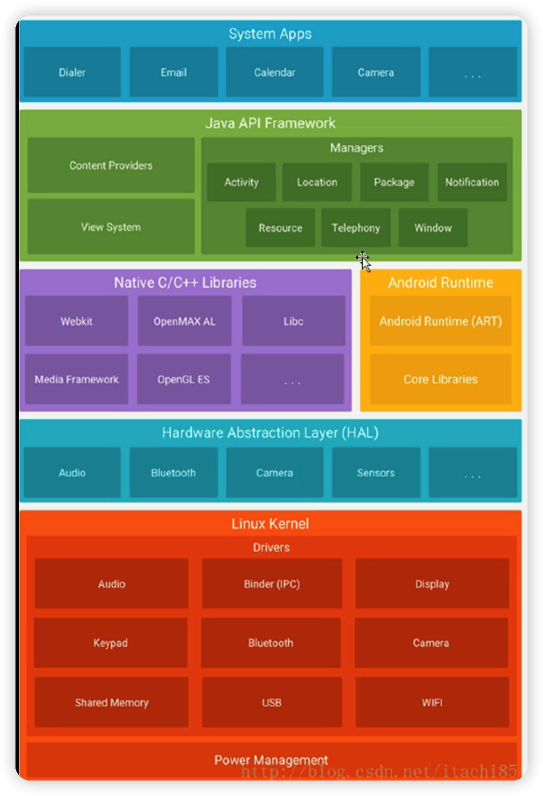

# Android Framework 开篇

> 本专栏根据**Android10** 的系统源码去分析Framework层的源码。在阅读源码之前，首先要了解Android整体的系统架构以及相关的目录。
>
> 有价值的参考：http://gityuan.com/android/
>
> Android 系统的发展历程：https://mp.weixin.qq.com/s/W38aauoCEEUbL8KvUkb_Rw
>
> 学习路径参考：[Android Framework 学习路线 @ 阿豪](https://yuandaimaahao.github.io/AndroidFrameworkTutorialPages/000.%20%E5%AD%A6%E4%B9%A0%E8%B7%AF%E7%BA%BF%E4%B8%8E%E6%8C%87%E5%8D%97/Android%20Framework%20%E5%AD%A6%E4%B9%A0%E8%B7%AF%E7%BA%BF.html)

学习Framework 源码的意义：

> - 参考系统应用的实现
>
> 车载Android应用开发，主要难点都集中在如何开发Android系统应用上。例如，定制Launcher时，我们首先需要理解原生的Launcher的实现方式，才能游刃有余地定制出符合产品需求的Android桌面。
>
> - 了解Android系统的运行原理
>
> AOSP包含了完整的Application、Framework、Native、HAL等各各层级的源码，我们在学习时可以修改源码、添加输出日志，再编译运行查看结果，这样可以方便我们直观的理解Android系统的运行机制。
>
> - 工作需要
>
> 有的公司在开发车载项目时会给开发开通整个源码权限，这样方便开发在本地编译Android源码进行烧机测试，那么就需要我们掌握整个Android源码的编译方式。。

Android Framework 学习路径： 
![[assets/Android Framework 学习路径-1697015695057-6.png]]

学习路线一共12个专题进行学习，具体的专题内容如下：

### 基础知识

- C/C++
  - 
- NDK/JNI
- Java
- Linux
- Shell
- Make命令
- Go
- Soogn

### AOSP 源码编译及构建

- AOSP 编译源码
- 内置APP
- OTA升级

### 系统启动过程

### Binder 设计思想

> Binder的系列文章总结，本系列文章先从尾到头，层层深入的讲法，先以通俗易懂的方式讲解Binder的通信原理(尾)，然后讲解Binder的使用(头)，在一步一步层层深入源码 更容易掌握Binder的本质。

- 《Binder的通信机制》

### Java Binder

- 《进程间通信的几种方式实现》

- 《AIDL 跨进程通信原理》

- 《bindService如何跨进程传递binder》

### Native Binder

- 《ServiceManager的Binder机制》
- 《ServiceManager注册服务的过程》
- 《ServiceManager获取服务的过程》
- 《ServiceManager的启动过程》

### 应用层框架

### 图形系统

### 系统应用开发

### 自定义系统服务

### 车载系统

### 音视频系统

### 性能优化

### Android 系统架构

Android 系统架构分为5层，从上到下依次是应用层、应用框架层、系统运行库层、硬件抽象层、Linux内核层。

应用框架层Framework层 所提供的组件如下： 

| 名称                            | 描述                                                         |
| ------------------------------- | ------------------------------------------------------------ |
| Activity Manager 活动管理器     | 管理各个应用程序生命周期以及通常的导航回退功能               |
| Location Manager 位置管理器     | 提供地理位置以及定位功能服务                                 |
| Package Manager 包管理器        | 管理所有安装在Android系统中的应用程序                        |
| Notification Manager 通知管理器 | 使得应用程序可以在状态栏中显示自定义的提示信息               |
| Resource Manager 资源管理器     | 提供应用程序使用的各种非代码资源，如本地化字符串、图片、布局文件、颜色文件等 |
| Telephony Manager 电话管理器    | 管理所有的移动设备功能                                       |
| Window Manager 窗口管理器       | 管理所有开启的窗口程序                                       |
| Content Providers 内容提供器    | 使得不同应用程序之间可以共享数据                             |
| View System 视图系统            | 构建应用程序的基本组件                                       |

#### 源码根目录

| Android 源码根目录 | 描述                                               |
| ------------------ | -------------------------------------------------- |
| art                | 全新的ART运行环境                                  |
| bionic             | 系统C库                                            |
| bootable           | 启动引导相关代码                                   |
| build              | 存放系统编译规则及generic等基础开发包配置          |
| cts                | Android兼容性测试套件标准                          |
| dalvik             | dalvik 虚拟机                                      |
| developers         | 开发者目录                                         |
| development        | 应用程序开发相关                                   |
| device             | 设备相关配置                                       |
| docs               | 参考文档目录                                       |
| external           | 开源模组相关文件                                   |
| frameworks         | 应用程序框架，Android系统核心部分，由Java和C++编写 |
| hardware           | 主要是硬件抽象层的代码                             |
| libcore            | 核心库相关文件                                     |
| libnativehelper    | 动态库，实现JNI库的基础                            |
| out                | 编译完成后代码输出在此目录                         |
| pdk                | Plug Development Kit的缩写，本地开发套件           |
| platform_testing   | 平台测试                                           |
| prebuilts          | x86和arm架构下预编译的一些资源                     |
| sdk                | sdk和模拟器                                        |
| packages           | 应用程序包                                         |
| system             | 底层文件系统库、应用和组件                         |
| toolchain          | 工具链文件                                         |
| tools              | 工具文件                                           |
| Makefile           | 全局Make file 用来定义编译规则                     |

#### 应用层源码目录

在Android源码根目录中的packages目录对应着系统应用层

| packages目录 | 描述           |
| ------------ | -------------- |
| apps         | 核心应用程序   |
| experimental | 第三方应用程序 |
| inputmethods | 输入法目录     |
| providers    | 内容提供者目录 |
| screensavers | 屏幕保护       |
| services     | 通信服务       |
| wallpapers   | 墙纸           |

#### 应用框架层(Framework)源码目录

应用框架层的主要实现在`frameworks/base`和`frameworks/av`目录下，其中`frameworks/base` 目录是我们主要阅读的部分。

| frameworks/base目录 | 描述                     |
| ------------------- | ------------------------ |
| api                 | 定义API                  |
| core                | 核心库                   |
| docs                | 文档                     |
| include             | 头文件                   |
| libs                | 库                       |
| media               | 多媒体相关库             |
| nfc-extras          | NFC相关                  |
| opengl              | 2D/3D图形API             |
| sax                 | XML解析器                |
| telephony           | 电话通讯管理             |
| tests               | 测试相关                 |
| vr                  | VR 相关                  |
| cmds                | 重要命令：am app_proce等 |
| data                | 字体和声音等数据文件     |
| graphics            | 图形图像相关             |
| keystone            | 数据签名相关             |
| location            | 地理位置相关             |
| native              | 本地库                   |
| obex                | 蓝牙传输                 |
| packages            | 设置、TTS、VPN程序       |
| services            | 系统服务                 |
| test-runner         | 测试工具相关             |
| tools               | 工具                     |
| wifi                | wifi无线网络             |
| ......              |                          |